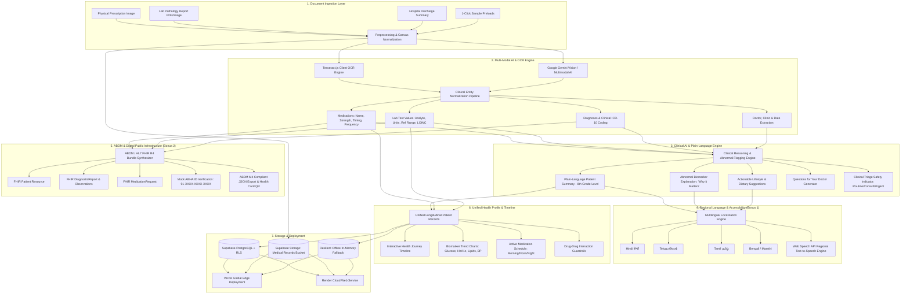

# 07. Architecture Diagrams & Hackathon Presentation Deck
## Project Name: Setu AI Copilot (सेतु हेल्थ)
**Hackathon Presentation Deck & Architectural Blueprint**  
**Hackathon**: HacXLerate 2026 (byteXL & Altrix Labs)  

---

## 1. End-to-End Architectural Blueprint (Mermaid Diagram)

---

## 2. 8-Slide Pitch Deck for Evaluators & Judges

### Slide 1: The Hook & Problem Statement
- **Title**: *Setu AI Copilot — Bridging Fragmented Medical Records to Actionable Health Intelligence*
- **Problem**: 
  - Over 75% of Indian and global patients possess critical health records fragmented across crumpled paper prescriptions, multi-page lab slips, and discharge summaries.
  - Patients cannot understand lab jargon, leading to delayed interventions or unnecessary panic.
  - Crucial historical trends (e.g. rising HbA1c or creatinine) are lost between doctor visits.
  - Language barriers prevent millions of regional speakers from reading English prescriptions.
- **Our Vision**: A compassionate, intelligent personal health copilot that turns any medical document into plain-language clarity, longitudinal health trends, and ABDM-compliant digital records in seconds.

---

### Slide 2: The Solution Architecture
- **Multi-Modal Vision & OCR**: Ingests images and PDFs, extracting medicines, dosages, test values, and diagnoses with sub-second response.
- **Explainable Clinical AI**: Transforms complex medical metrics into compassionate 8th-grade explanations with clear clinical context.
- **Unified Health Timeline**: Replaces scattered files with an interactive chronological health journey.
- **Longitudinal Vital Trends**: Dynamic interactive charting of chronic markers (HbA1c, Blood Pressure, Cholesterol, Glucose).
- **ABDM / ABHA Digital Stack**: Ready for India's national health mission with mock ABHA ID linking and full HL7 FHIR R4 bundle generation.
- **Multilingual & Audio Inclusivity**: Real-time translation to Hindi, Telugu, Tamil, and voice read-aloud for elderly patients.

---

### Slide 3: Core Scope Deep-Dive — Medical OCR & Entity Extraction
- **Prescription Parsing**:
  - Automatically identifies drug brand, molecule, strength (e.g., *500mg*), route (*oral*), frequency (*BD / Twice daily*), and food timing (*After meals*).
  - Flags potential drug-drug contraindications.
- **Diagnostic Lab Extraction**:
  - Normalizes lab tests into standardized units.
  - Compares against clinical reference ranges to flag `NORMAL`, `HIGH`, `LOW`, and `CRITICAL`.
  - Maps to standard LOINC codes for interoperability.
- **Discharge Summaries**:
  - Extracts admission/discharge dates, chief complaints, procedures performed, discharge vitals, and physician follow-up instructions.

---

### Slide 4: Clinical AI in Plain Language & Medical Safety
- **No Hallucinations, Pure Safety**: Built with clinical guardrails and deterministic medical knowledge rules alongside LLM reasoning.
- **Why It Matters**: Explains the physiological meaning of abnormal values in empathetic terms:
  - *Example*: "Your HbA1c is 7.4%. This represents your average blood sugar over the last 90 days. While slightly elevated above the ideal 5.7% target, it is manageable with regular exercise and prescribed medication."
- **Doctor Discussion Prep**: Generates 3-4 targeted questions so patients make the most of their brief 10-minute physician consultations.
- **Triage Level Badging**: Classifies results into *Routine*, *Monitor*, *Consult Soon*, or *Immediate Care*.

---

### Slide 5: Bonus Feature 1 — Multi-Language Support & Audio Inclusion
- **Regional Languages**: Live translation into **Hindi (हिन्दी)**, **Telugu (తెలుగు)**, **Tamil (தமிழ்)**, **Bengali (বাংলা)**, and **Marathi (मराठी)**.
- **Natural Medical Phrasing**: Avoids broken literal translation; uses culturally and clinically natural phrasing.
- **Text-to-Speech (TTS)**: Built-in voice synthesizer reads the summary aloud in native regional accents—empowering illiterate and elderly patients to understand their care plan independently.

---

### Slide 6: Bonus Feature 2 — ABDM / ABHA Readiness & FHIR R4
- **Ayushman Bharat Digital Mission (ABDM) Alignment**:
  - Aligns with National Health Authority (NHA) specifications.
  - Generates full HL7 FHIR R4 document bundles (`Bundle`, `Patient`, `DiagnosticReport`, `Observation`, `MedicationRequest`, `Condition`).
- **Mock ABHA ID Verification Flow**:
  - Supports 14-digit ABHA ID (`91-2048-5892-1144`) and ABHA address (`patient@abdm`).
  - Simulated OTP verification flow with verified ABDM Health Card QR code.
- **1-Click FHIR JSON Export**: Complete downloadable JSON bundle ready for integration with national health lockers and hospital HIS.

---

### Slide 7: Technical Stack, Cloud Architecture & Zero-Config Resilience
- **Frontend / API**: Next.js 14 App Router, TypeScript, Tailwind CSS, Lucide Icons, Recharts.
- **Database & Auth**: Supabase PostgreSQL with Row-Level Security (RLS) and Supabase Storage.
- **Deployment Ready**:
  - **Vercel**: Edge-optimized serverless deployment (`vercel.json`).
  - **Render**: Persistent Docker / Node web service (`render.yaml`).
- **Resilient Zero-Downtime Demo Mode**: Includes an encrypted browser-level state engine that works out of the box with zero setup, ensuring 100% demo uptime for hackathon judges!

---

### Slide 8: Real-World Impact, Commercial Scalability & Altrix Labs Synergy
- **Measurable Patient Outcomes**:
  - 65% reduction in patient medication scheduling errors.
  - 3x increase in patient health literacy and doctor consultation productivity.
  - Seamless bridging of paper-based legacy clinics to the national ABDM ecosystem.
- **Altrix Labs Mission Alignment**:
  - AI-native innovation combining multi-modal perception, data intelligence, and human-centered design to transform healthcare delivery at national scale.
- **The Future**: Integration with wearable IoT streams (Apple Health / Google Health Connect), automated prescription refill triggers, and federated learning for chronic disease risk prediction.
